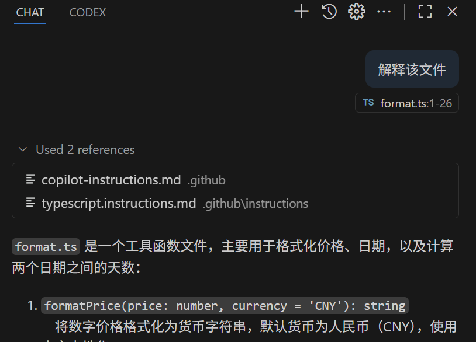

## GitHub Copilot Lab

### 什么是 Copilot 指令（Instructions）？

GitHub Copilot 的“指令”（Instructions）是一组持续生效的上下文提示，你可以把它理解为：在真正开始每一次对话或生成代码前，提前告诉 Copilot “我是谁、我偏好的风格、我当前项目的约束、请优先遵守什么规则”。它的作用是让 Copilot 自动遵循这些偏好，而不需要你每次重复说明。

核心特点：

- **持久性**：设置一次，在当前环境/会话中持续生效
- **强化一致性**：确保命名规范、框架约定、错误处理风格等统一
- **减少重复输入**：免去频繁粘贴“背景/约束/风格”描述

### 在本 Lab 中的应用

在本实验中，我们将使用 GitHub Copilot 来：

- 创建适用于所有目标代码文件的 copilot-instructions.md 文件
- 创建适用于 typescript 文件的 typescript.instructions.md 文件

---

## 实验环境要求

### 软件要求

- **Node.js**: >= 22.0.0
- **npm**: >= 10.0.0
- **VS Code**: 最新版本
- **GitHub Copilot**: 已登陆

---

## Lab 步骤

#### 1.1 目标

创建相关 instructions 文件

#### 1.2 操作步骤

1. **创建.github 文件夹**

   ```bash
   mkdir .github
   cd .github
   ```

2. **创建 copilot-instructions.md**
   在 VS Code 中打开 Copilot Chat，选择 Agent 模式，输入以下提示词：

   ```
   将PRD.md的内容创建到.github/copilot-instructions.md
   ```

3. **创建 typescript.instructions.md**
   在 VS Code 中打开 Copilot Chat，选择 Agent 模式，输入以下提示词：

   ```
   创建.github/instructions文件夹，并创建typescript.instructions.md。内容是适合typescript的编码规范
   ```

4. **解释代码**
   在 vs code 中关闭所有已经打开的文件，然后打开一个 typescript 文件，使用 copilot chat 解释该文件的代码逻辑，确保理解代码内容。
   ```
   解释该文件
   ```

#### 1.3 验证

- copilot-instructions.md 和 typescript.instructions.md 都被自动引用



---

# Lab 02 - Customize Instructions

概述

- 为团队创建全局与专用的 Copilot Instructions（使用说明）以统一编码风格与约束。

目标

- 定义全局指令模板与示例。
- 为常见任务创建专用 instruction 示例（如 lint、commit message、测试用例生成等）。

前置条件

- 团队编码规范草案（代码风格、提交信息规则等）。
- 能访问并配置 Copilot/IDE 的 Instructions 功能。

步骤

1. 编写全局指令模板（例如：语言、风格、注释规范、测试覆盖率期望）。
2. 针对不同场景创建示例 instruction：
   - 新功能实现
   - Bug 修复
   - 单元测试编写
3. 在团队仓库中创建 .copilot/instructions/ 并存放模板与示例。
4. 在团队内做一次演示并收集反馈，迭代指令内容。

产出 / 检查点

- .copilot/instructions/global.md
- 示例 instruction 文件
- 反馈记录与更新日志

参考

- GitHub Copilot 指令相关文档
