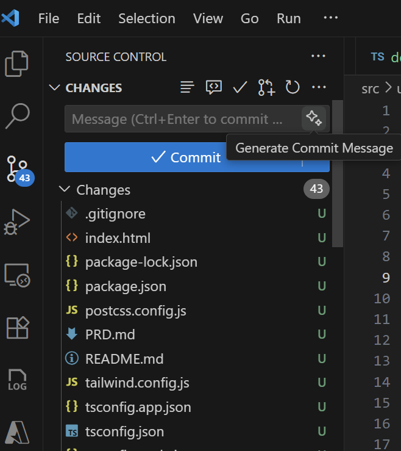
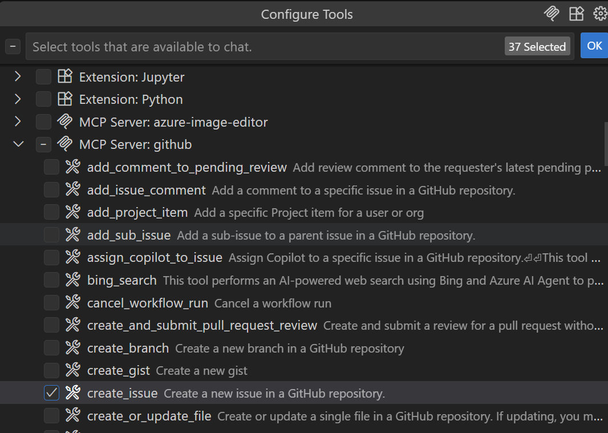
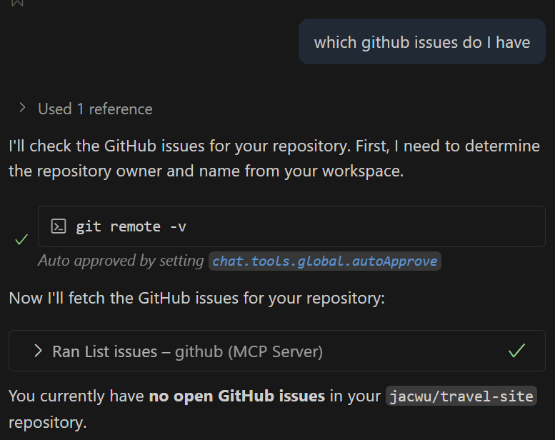
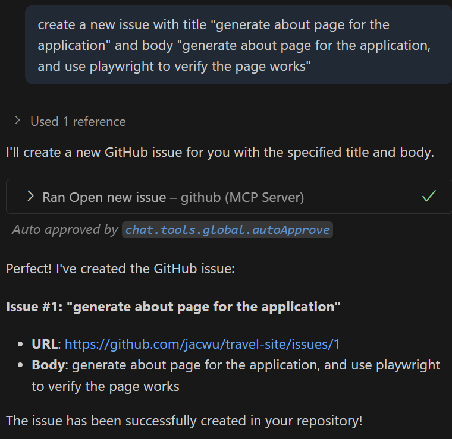
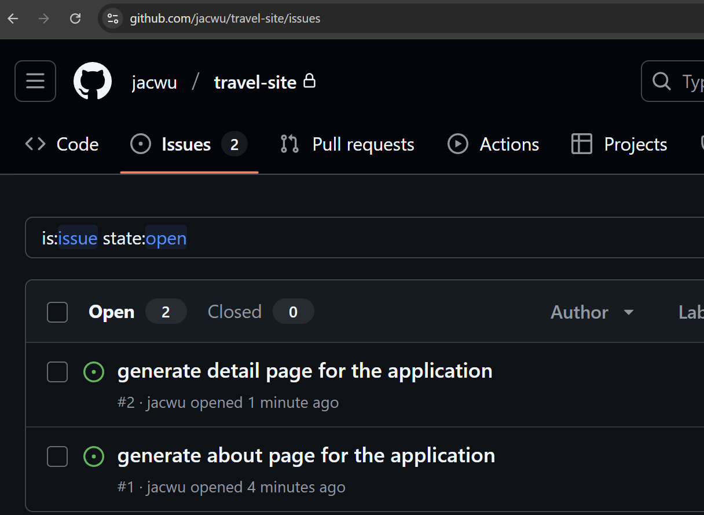

## GitHub Copilot Lab

### 什么是 MCP Server？

MCP（Model Context Protocol）Server 是一种用于为 AI（如 GitHub Copilot Chat / 其它兼容客户端）动态提供“上下文 + 工具能力”的标准化服务端组件。它的目标：让模型在对话/生成代码时，不再局限于静态提示，而是能够“按需取用”来自你本地或远程系统的：数据、文件、数据库、API、脚本执行结果、领域知识库等。

#### 核心价值

- 可扩展：一个客户端可同时连接多个不同能力的 MCP Server（例如：文件系统、数据库、日志检索、部署平台、监控告警）。
- 最小侵入：不需要改造现有系统，只需包装一个适配层即可暴露能力。
- 上下文精准：相比把大量信息“塞”进提示语，MCP 允许按需获取，减少 token 浪费并提升响应相关性。

---

### 在本 Lab 中的应用

在本实验中，我们将使用 GitHub Copilot 来：

- 创建 commit message，并将代码库传到 github
- 通过 github mcp server 获得已有 issue，并创建新 issue

---

## 实验环境要求

### 软件要求

- **Node.js**: >= 22.0.0
- **npm**: >= 10.0.0
- **VS Code**: 最新版本
- **GitHub Copilot**: 已登陆

---

## Lab 步骤

### 第一步：创建 PRD 文档

#### 1.1 目标

创建相关 instructions 文件

#### 1.2 操作步骤

1. **提交 git**
   使用 github copilot 创建 commit message，并提交本地
   

2. **将本地代码库提交到 github**
   在 vscode 中将代码库提交到 github

#### 1.3 验证

- 在 github 上可以看到提交的代码库

### 第二步：配置 github mcp server

#### 2.1 目标

正确配置 github mcp server

#### 2.2 操作步骤

1. **创建 mcp.json**
   在.vscode 下创建 mcp.json,内容如下：

```json
{
  "servers": {
    "github": {
      "type": "http",
      "url": "https://api.githubcopilot.com/mcp/"
    }
  }
}
```

2. **启动 mcp server**
   打开 mcp.json 文件，点击“start”，根据提示进行身份验证

3. **查看 github mcp server 能力工具**
   确保 create_issue 和 list_issues 工具可用
   

#### 2.3 验证

- 在 github 上可以看到提交的代码库

### 第三步：使用 github mcp server

#### 3.1 目标

通过 github mcp server 查询已有 issue，并创建新 issue

#### 3.2 操作步骤

1. **查询已有 issue**
   在 VS Code 中打开 Copilot Chat，选择 Agent 模式，输入以下提示词：

   ```
   which github issues do I have
   ```

   

2. **创建新 issue**
   在 VS Code 中打开 Copilot Chat，选择 Agent 模式，输入以下提示词：

   ```
   create a new issue with title "generate about page for the application" and body "generate about page for the application, and use playwright to verify the page works"
   ```

   

3. **创建新 issue**
   在 VS Code 中打开 Copilot Chat，选择 Agent 模式，输入以下提示词：
   ```
   create a new issue with title "generate detail page for the application" and body "generate detail page for the application. user click any destination card in home page, the application will redirect to a detail page for the destination. use playwright to verify the page works"
   ```

#### 3.3 验证

- 在 github 上可以看到新创建的 issue
  

---

# Lab 03 - MCPServer

概述

- 在 VS Code 中配置 MCP Server（Mock/Model/Control 平台示例）并学习如何用其加速本地开发与联调。

目标

- 搭建本地 MCP Server（或使用已有服务）。
- 在 VS Code 中配置并通过代理/调试进行集成测试。

前置条件

- Node.js、npm/yarn。
- VS Code 及相关扩展（如 REST Client、Debugger）。

步骤

1. 搭建简单的本地 MCP Server（示例使用 express）：
   - 创建 server 文件并启动：node server.js
2. 在 VS Code 配置 launch.json / tasks.json 以便一键启动 server。
3. 使用 REST Client 或内置调试器对接入点进行测试。
4. 将 mock 数据和契约文档保存在 /mcp/contracts。

产出 / 检查点

- 可启动的本地 MCP Server
- VS Code 一键启动/调试配置
- contracts/ 中的 mock 数据与契约样例

参考

- Express 快速入门
- VS Code 调试配置文档
