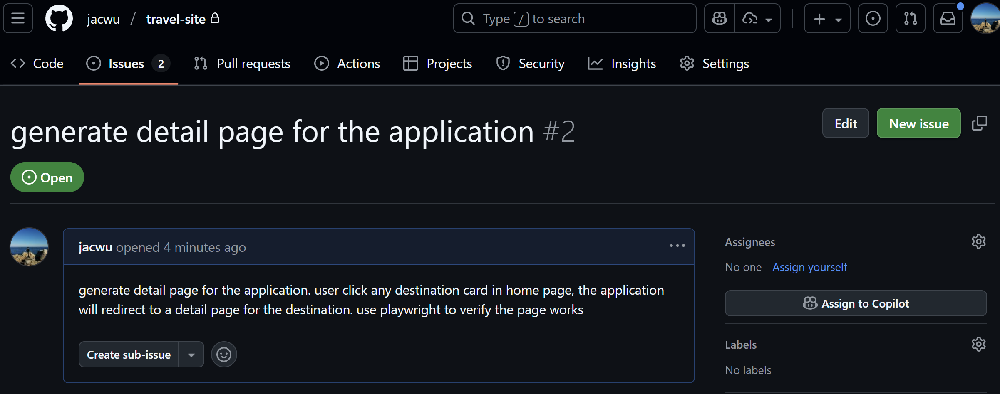
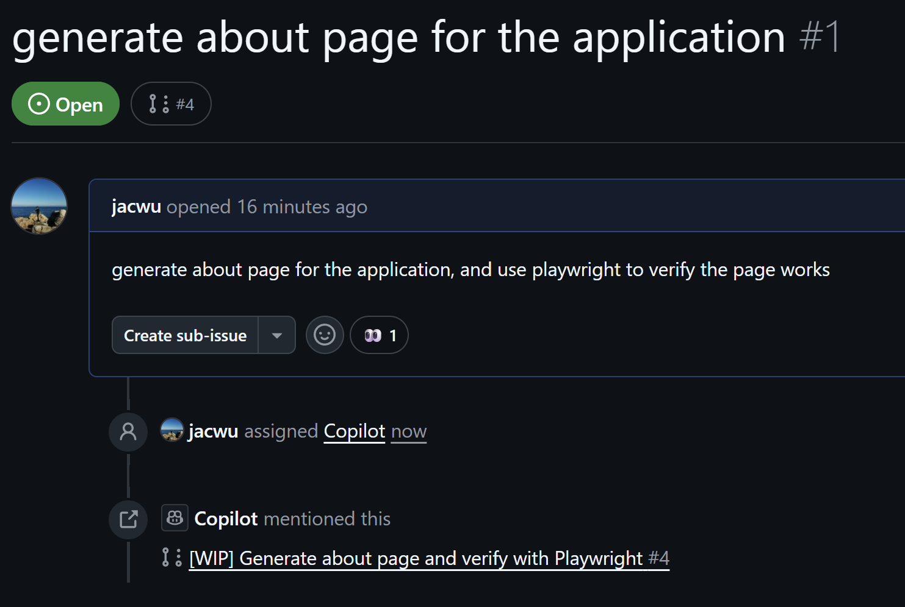
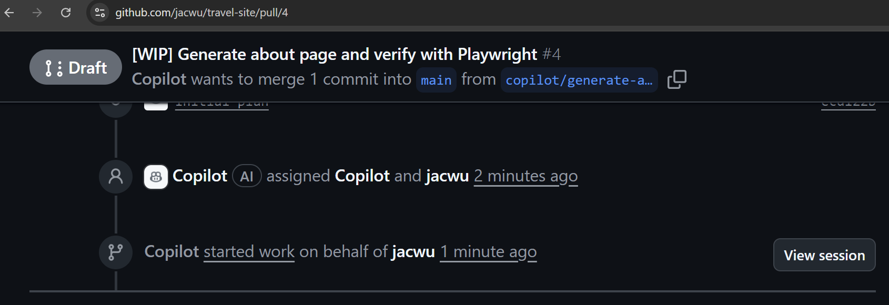
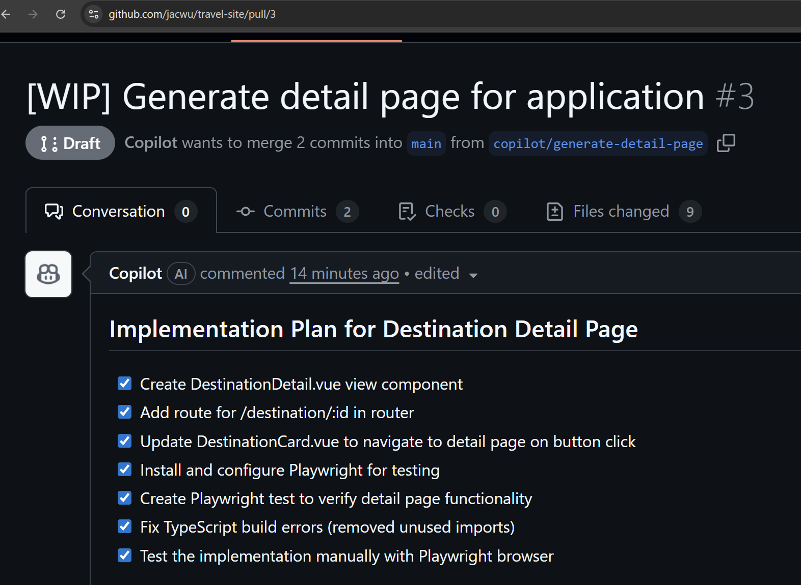

## GitHub Copilot Lab

### 什么是 Coding Agent？

Coding Agent（编码智能代理）是 github 上能够“理解自然语言需求 + 主动规划步骤 + 自动在代码仓库中执行具体操作”的 AI 编程执行体。它不仅生成代码片段，更像一位可托付子任务的协作型虚拟开发者。GitHub Copilot 的 _Agent 模式_ 就是这种理念的实现：你给出目标，Agent 读取仓库上下文，制定行动计划，并自动完成文件创建、修改、分析、测试、提交乃至发起 Pull Request。

核心能力：

- **意图理解**：将自然语言/半结构化描述转化为可执行的开发子任务。
- **上下文感知**：读取当前仓库文件、依赖、语言规范、已有实现，避免“脱离项目现实”地生成代码。
- **产物交付**：生成补丁、提交（commit）、分支（branch）、Pull Request，形成可审阅增量。
- **可解释性**：能说明“它要做什么 / 为什么这么改 / 下一步是什么”。

### 在本 Lab 中的应用

在本实验中，我们将使用 GitHub Copilot 来：

- 使用 coding agent 完成在 lab3 中创建的两个 issue

---

## 实验环境要求

### 软件要求

- **Node.js**: >= 22.0.0
- **npm**: >= 10.0.0
- **VS Code**: 最新版本
- **GitHub Copilot**: 已登陆

---

## Lab 步骤

#### 1.1 目标

使用 coding agent 完成在 lab3 中创建的两个 issue

#### 1.2 操作步骤

1. **使用 coding agent**
   在 github 中打开创建好的第一个 issue，点击“Asign to copilot”按钮
   

2. **使用 coding agent**
   在 github 中打开创建好的第二个 issue，点击“Asign to copilot”按钮

3. **查看 PR**
   在 issue 页面可以看到 github copilot 已经开始启动一个 PR 来解决 issue
   

4. **查看进度**
   在 issue 界面，点击 PR。在 PR 页面，点击 View Session 可以看到 github copilot 的进度。注意：coding agent 处理一个 issue 可能需要几分钟到十几分钟的时间（取决于任务复杂度），实际使用中适合异步执行。在等待期间，开发人员可以进行其他工作。
   

5. **查看结果**
   待几分钟后，在 PR 页面可以看到 github copilot 已经完成了代码的修改，点击 Files changed 可以看到修改的内容。如果不满意，可以@copilot 让其继续修改。
   

6. **合并 PR**
   如果对修改的内容满意，可以点击 Merge pull request 按钮将修改合并到 main 分支。

#### 1.3 验证

- 将代码同步到本地后，可以正确运行

---

# Lab 04 - CodingAgent

概述

- 使用 GitHub Coding Agent 自动读取 Issue 并生成/修改代码，然后提交 PR 的工作流示例。

目标

- 将 Issue 转化为实现任务并生成代码建议。
- 自动化生成初始 PR（草稿），供人工审查。

前置条件

- 已启用 GitHub Coding Agent 或相关自动化工具。
- 有可测试的示例 Issue。

步骤

1. 选择一个带有清晰描述的 Issue。
2. 启动 Coding Agent，传入 Issue 内容与仓库上下文。
3. 检查 Agent 输出的代码补丁，运行本地测试。
4. 将通过的更改提交为 PR 并附上 Agent 生成的变更说明供审查。

产出 / 检查点

- Agent 生成的代码补丁
- 本地测试通过记录
- 创建的 PR 链接与审查总结

参考

- GitHub Coding Agent 文档
