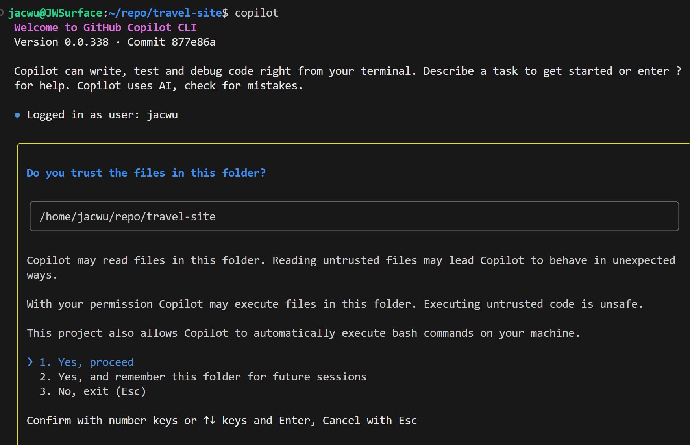
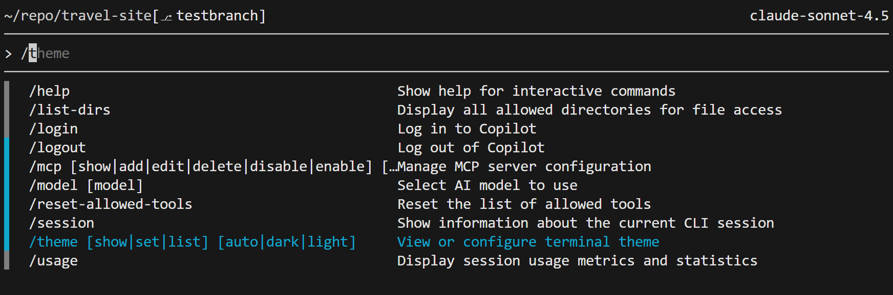
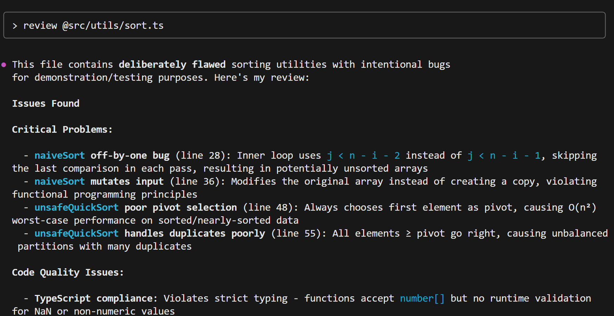

## GitHub Copilot Lab

### 什么是 Copilot CLI？

Copilot CLI 是 GitHub 提供的命令行交互增强工具，帮助你用自然语言高效驾驶终端工作流。借助它，你可以在终端中完成：命令生成、命令意义解析、生成代码、错误原因分析以及多步操作草稿规划等任务。

## 实验环境要求

### 软件要求

- **Node.js**: >= 22.0.0
- **npm**: >= 10.0.0
- **VS Code**: 最新版本
- **GitHub Copilot**: 已登陆

---

## Lab 步骤

#### 1.1 目标

使用 Copilot CLI 对已有代码进行审查

#### 1.2 操作步骤

1. **安装**
   在命令行中执行以下命令

   ```bash
   npm install -g @github/copilot
   ```

2. **启动 Copilot CLI**
   在命令行导航到项目文件夹，键入"copilot"命令，进行登陆。
   

3. **使用 Copilot CLI**
   键入"/"查看所有支持的命令
   

4. **使用 Copilot CLI**
   键入"review @sort.ts" 让 copilot 对 sort.ts 文件进行代码审查 （注意按实际情况更换 sort.ts 的地址）
   

#### 1.3 验证

- Copilot CLI 可以正确运行，并对 sort.ts 文件进行代码审查

# Lab 06 - CopilotCLI

概述

- 使用 Copilot CLI 对代码、提交和命令进行自动化建议与审查。

目标

- 利用 CLI 生成代码片段、改进提交信息和执行安全检查。

前置条件

- 安装并配置 Copilot CLI（或等效工具）。
- 有示例代码仓库与要审查的提交。

步骤

1. 安装 Copilot CLI 并登录。
2. 在仓库根目录执行示例命令：
   - copilot generate "实现用户登录 API" --output patch.diff
3. 审查生成的 patch，应用并运行测试。
4. 使用 copilot lint 或类似命令进行静态检查。

产出 / 检查点

- 生成的补丁文件
- lint / test 报告
- 应用的提交记录

参考

- Copilot CLI 官方文档
