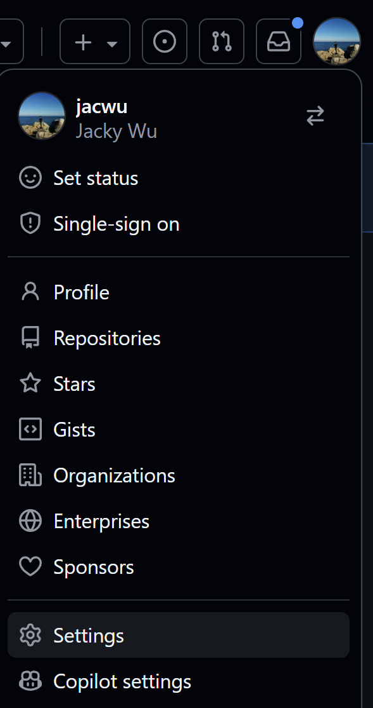
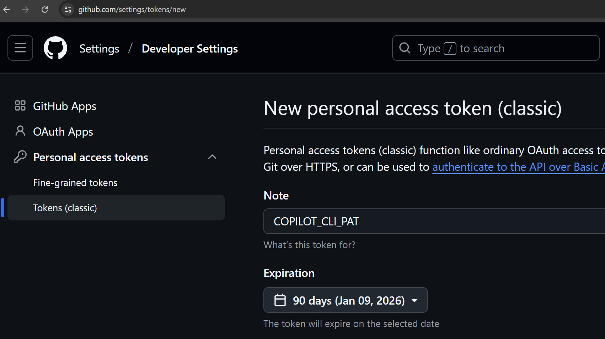
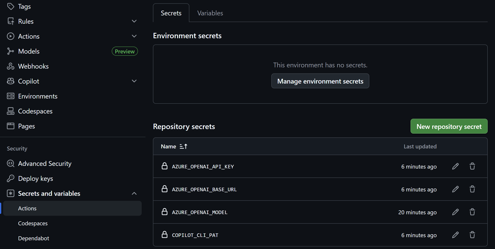
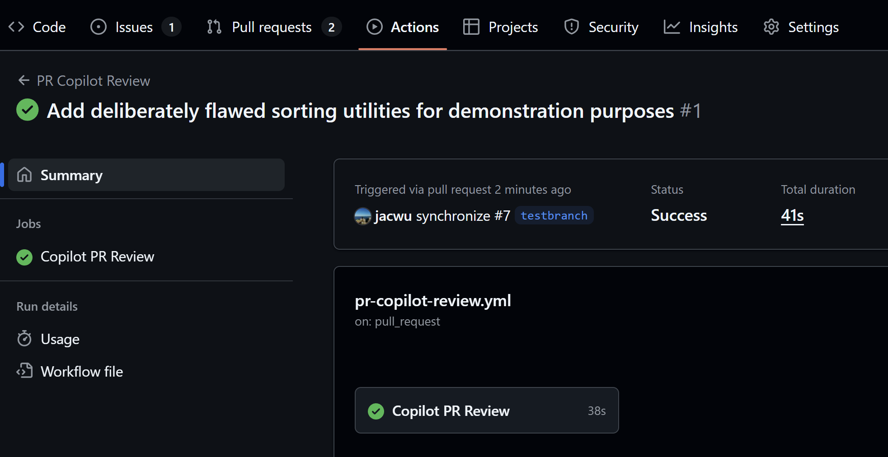
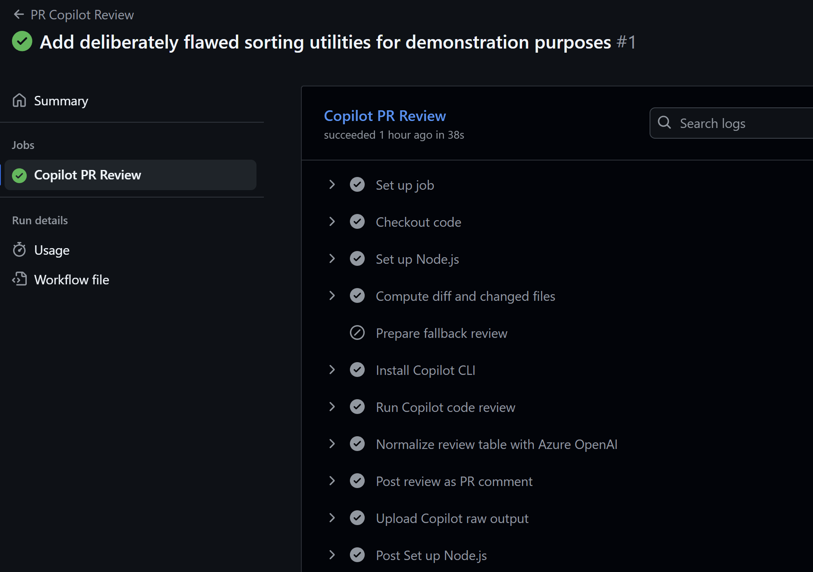

## GitHub Copilot Lab

### 为什么进行 Copilot CLI 集成？

Copilot CLI 支持通过 PAT（Personal Access Token）进行登陆，从而可以方便地运行在各类 CI/CD 环境，包括 GitHub，GitLab，Jenkins 和 AzureDevOps 等。通过进行 Copilot CLI 集成，可以让你在这些环境中也能享受 Copilot 带来的便利，大大拓展 Copilot 的使用场景。

### 在本 Lab 中的应用

在本实验中，我们将：

- 把 Copilot CLI 集成到 GitHub 流水线，当有新的 PR 时，自动触发 Copilot CLI 对代码进行审查
- 把 Azure OpenAI 集成到 GitHub 流水线，对 Copilot CLI 的分析结果进行总结，并反馈到 PR
- 注意：本例仅以代码审查为例，实际可以根据需求进行更多定制化操作

## 实验环境要求

### 软件要求

- **Node.js**: >= 22.0.0
- **npm**: >= 10.0.0
- **VS Code**: 最新版本
- **GitHub Copilot**: 已登陆

---

## Lab 步骤

### 第一步：创建 PAT

#### 1.1 目标

创建 PAT

#### 1.2 操作步骤

1. **登陆 GitHub**
   登陆 GitHub，进入 Settings
   

2. **创建 PAT**
   选择 Developer settings -> Personal access tokens -> Tokens (classic)，点击 Generate new token，生成 token 并保存
   

#### 1.3 验证

- Token 创建成功，并保存到本地

### 第二步：创建 GitHub Secret

#### 2.1 目标

为 Repository 创建 Secret

#### 2.2 操作步骤

1. **登陆 GitHub 里的目标 Repository**
   登陆 GitHub，进入目标 Repository，进入 Settings

2. **创建 Secret**
   选择 Secrets and variables -> Actions，点击 New repository secret，依次输入以下名称和对应值。其中 COPILOT_CLI_PAT 为步骤一中保存的 PAT
   ```
   COPILOT_CLI_PAT
   AZURE_OPENAI_API_KEY
   AZURE_OPENAI_BASE_URL
   AZURE_OPENAI_MODEL
   ```
   

#### 2.3 验证

- Secret 创建成功

### 第三步：在 GitHub Action 集成 Copilot CLI 和 Azure OpenAI

#### 3.1 目标

集成 Copilot CLI 和 Azure OpenAI 到 GitHub 流水线

#### 3.2 操作步骤

1. **在 VS Code 中打开本地仓库**
   确保仍然在 feature/testbranch 分支

2. **创建 GitHub Actions 工作流文件**
   创建.github/workflows/pr-copilot-review.yml,内容请参考https://github.com/jacwu/github-materials/blob/main/.github/workflows/pr-copilot-review.yml

3. **创建 Python 脚本调用 Azure OpenAI**
   创建 scripts/normalize_review_result.py,内容请参考https://github.com/jacwu/github-materials/blob/main/scripts/normalize_review_result.py

4. **提交代码并 Push 到远程**
   提交代码到本地，并 push 到远程仓库。本次 Commit 会触发第五步尚未 Merge 的 PR。本次 PR 将触发 GitHub Actions 工作流，自动进行代码审查并反馈结果到 PR

#### 3.3 验证

- 进入 Actions 页面，触发了 GitHub Actions 工作流
  

- 进入工作流运行详情，可以看到"Run Copilot Code Review"和"Normalize Review Table with Azure OpenAI"两个步骤均正确运行
  

- 回到 PR 页面，可以看到代码审查结果。注意：由于本次提交只有 yaml 和 python 脚本，审查可能不会发现明显代码问题。用户可以自行提交有问题的代码进一步实验

# Lab 07 - CopilotCLIIntegration

概述

- 在 GitHub Actions 工作流中集成 Copilot CLI 与 Azure OpenAI，自动化代码建议与审查流程。

目标

- 创建一个示例 GitHub Actions 工作流，调用 Copilot CLI 或代理服务进行自动化检查。
- 将结果注入 PR 评论或作为 workflow artifact。

前置条件

- GitHub 仓库访问权限与 Actions 启用。
- Azure OpenAI / API 凭据（如用于模型调用）。

步骤

1. 在 .github/workflows/ 中创建示例 workflow（YAML）。
2. 在 workflow 中安装 Copilot CLI 并配置环境变量（AZURE_OPENAI_KEY 等）。
3. 在 PR 事件触发时运行：copilot generate / copilot review，并将输出保存为 artifact。
4. 使用 GitHub Actions 步骤将审查结果发布为 PR 注释或 artifact。

产出 / 检查点

- .github/workflows/copilot-integration.yml 示例
- Actions 运行日志与生成的审查报告
- PR 中自动添加的审查注释

参考

- GitHub Actions 文档
- Azure OpenAI 使用说明
